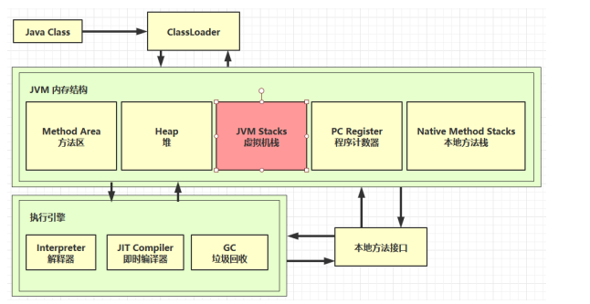
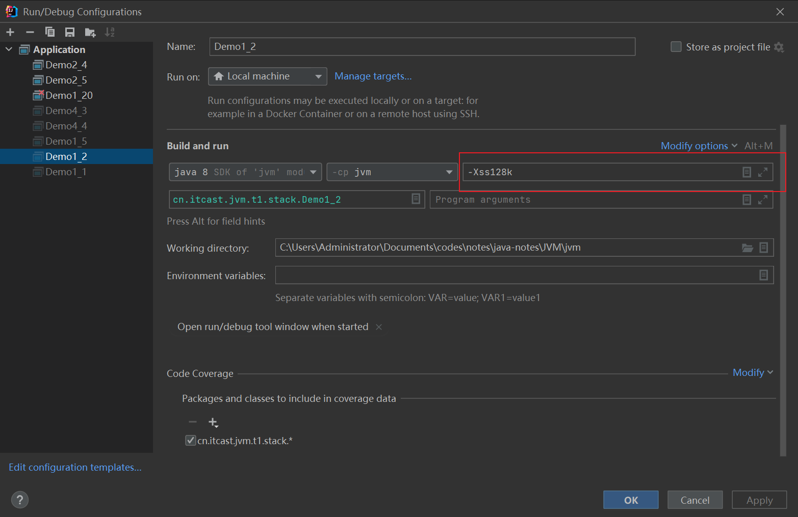
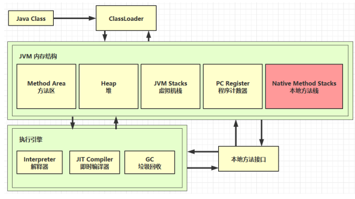
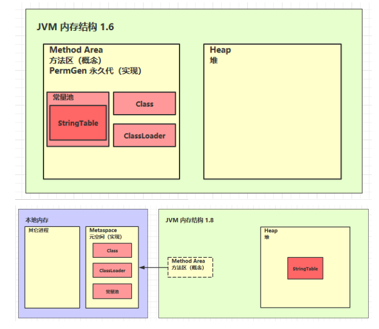

# JVM笔记

# 引言

* 理解底层的实现原理
* 中高级程序员的必备技能

# 内存结构

## 程序计数器


Program Counter Register 程序计数器（寄存器）

* 作用是记住下一条JVM指令的执行地址
* 特点
  * 线程私有
  * 不会存在内存溢出

## 虚拟机栈

### 定义



栈：先进后出

* 线程运行需要的内存空间，成为虚拟机栈
* 每个线程有多个栈帧(Frame)组成，对应每次方法调用所占用的内存
* 每个线程只能有一个活动栈帧，对应着当前正在执行的那个方法

问题辨析

1. 垃圾回收是否涉及栈内存

   不涉及，栈内存只有方法调用产生的栈帧内存，每次返回的时候自动跳出，不需要垃圾回收

2. 栈内存分配越大越好吗

   可以增加每次方法调用的次数，但是运行的线程次数可能会变少，不会提高运行的效率，一般用系统默认的栈内存

3. 方法内的局部变量是否线程安全

   * 如果方法内局部变量没有逃离方法的作用访问，它是线程安全的
   * 如果是**局部变量引用了对象，并逃离方法的作用范围**，需要考虑线程安全

### 栈内存溢出

* 栈帧**过多**导致栈内存溢出-方法的递归调用
* 栈帧**过大**导致栈内存溢出-栈帧超过栈内存

> 一般常出现的是栈帧过多导致栈内存溢出，例如多次递归调用

栈内存溢出的错误是：

```java
java.lang.StackOverflowError
```

在IDEA中可以设置JVM运行虚拟机的栈内存大小`-Xss128k`



### 线程运行诊断

案例1：CPU占用过多

定位：

* 用top定位哪个进程对CPU的占用过高
* `ps H -eo pid, tid, %cpu |grep 进程id` 用`ps`命令进一步定位哪个线程引起的CPU占用过高
* `jstack 进程id`
  * 这里的进程id是十六进制
  * 可以根据线程id找到有问题的线程，进一步定位到问题代码的源码行号

案例2：程序运行很长时间没有结果

* 发生死锁

## 本地方法栈



java代码不能和底层操作系统打交道，用其他代码编写的方法运行的栈叫做本地方法栈

## 堆


### 定义

`Heap `堆

* 通过 `new` 关键字，创建对象都会使用堆内存

特点

* 它是线程共享的，堆中对象都需要考虑线程安全的问题
  * 有垃圾回收机制，堆中不再被引用的对象																			会被回收

### 堆内存溢出

内存溢出报错

```java
java.lang.OutOfMemoryError: Java heap space
```

设置堆内存空间

```
-Xmx8m
```

> 排除堆内存可能出现溢出的问题，可以将堆内存空间设置小一点

### 堆内存诊断

1. jps工具
   * 查看当前系统中有哪些java进程
2. jmap工具
   * 查看堆内存占用情况
3. jconsole工具
   * 图形界面的，多功能的检测工具，可以连续监测

## 方法区


### 组成



### 方法区内存溢出问题

* 1.8 以前会导致永久代内存溢出

  * 演示永久代内存溢出 `java.lang.OutOfMemoryError: PermGen space`

  * `-XX:MaxPermSize=8m`

* 1.8 之后会导致元空间内存溢出

  * 演示元空间内存溢出 `java.lang.OutOfMemoryError: Metaspace `
  * `-XX:MaxMetaspaceSize=8m`

场景

* spring
* mybatis

### 运行时常量池

* 常量池，就是一张表，虚拟机指令根据这张常量表找到要执行的类名、方法名、参数类型、字面量 等信息
* 运行时常量池，常量池是 *.class 文件中的，当该类被加载，它的常量池信息就会放入运行时常量池，并把里面的符号地址变为真实地址

例题

```java
String s1 = "a";
String s2 = "b";
String s3 = "a" + "b";
String s4 = s1 + s2;
String s5 = "ab";
String s6 = s4.intern();
// 问
System.out.println(s3 == s4); // false
System.out.println(s3 == s5); // true
System.out.println(s3 == s6); // true
String x2 = new String("c") + new String("d");
String x1 = "cd";
x2.intern();
// 问，如果调换了【最后两行代码】的位置呢，如果是jdk1.6呢
System.out.println(x1 == x2); // false true
// 1.6中调换最后两行，最后一个结果仍然是false
```


```java
// StringTable [ "a", "b" ,"ab" ]  hashtable 结构，不能扩容
public class Demo1_22 {
    // 常量池中的信息，都会被加载到运行时常量池中， 这时 a b ab 都是常量池中的符号，还没有变为 java 字符串对象
    // ldc #2 会把 a 符号变为 "a" 字符串对象
    // ldc #3 会把 b 符号变为 "b" 字符串对象
    // ldc #4 会把 ab 符号变为 "ab" 字符串对象

    public static void main(String[] args) {
        String s1 = "a"; // 懒惰的
        String s2 = "b";
        String s3 = "ab";
        String s4 = s1 + s2; // new StringBuilder().append("a").append("b").toString()  new String("ab")
        String s5 = "a" + "b";  // javac 在编译期间的优化，结果已经在编译期确定为ab

        System.out.println(s3 == s5);


    }
}
```

> 字符串加载延迟加载

### StringTable 特性

* 常量池中的字符串仅是符号，第一次用到时才变为对象 
* 利用串池的机制，来避免重复创建字符串对象 
* 字符串变量拼接的原理是 `StringBuilder `（1.8） 
* 字符串常量拼接的原理是编译期优化 
* 可以使用 `intern `方法，主动将串池中还没有的字符串对象放入串池
  * 1.8 将这个字符串对象尝试放入串池，如果有则并不会放入，如果没有则放入串池， 会把串池中的对象返回 
  * 1.6 将这个字符串对象尝试放入串池，如果有则并不会放入，如果没有会把此对象**复制**一份， 放入串池， 会把串池中的对象返回

> 也就是说1.6串池和字符串对象不相等

### StringTable性能调优

* 调整 -XX:StringTableSize=桶个数，可以加速 Hash 查找，加快入池速度
* 考虑将字符串对象是否入池

> 如果存在大量字符串，并且这些字符串可能存在重复，可以将这些字符串进行入池，可以大大减少内存占用

## 直接内存

Direct Memory 

* 常见于 NIO 操作时，用于数据缓冲区 
* 分配回收成本较高，但读写性能高 
* 不受 JVM 内存回收管理

传统的文件读取流程


使用直接内存的文件读取流程

磁盘文件内容直接读取到直接内存中，java代码可以直接读取直接内存中的内容


> * 直接内存也会导致内存溢出

### 分配回收原理

* 使用了 Unsafe 对象完成直接内存的分配回收，并且回收需要主动调用 freeMemory 方法 
* ByteBuffer 的实现类内部，使用了 Cleaner （虚引用）来监测 ByteBuffer 对象，一旦 ByteBuffer 对象被垃圾回收，那么就会由 ReferenceHandler 线程通过 Cleaner 的 clean 方法调用 freeMemory 来释放直接内存

> `-XX:+DisableExpliciGC` 禁用显式的垃圾回收

# 垃圾回收


