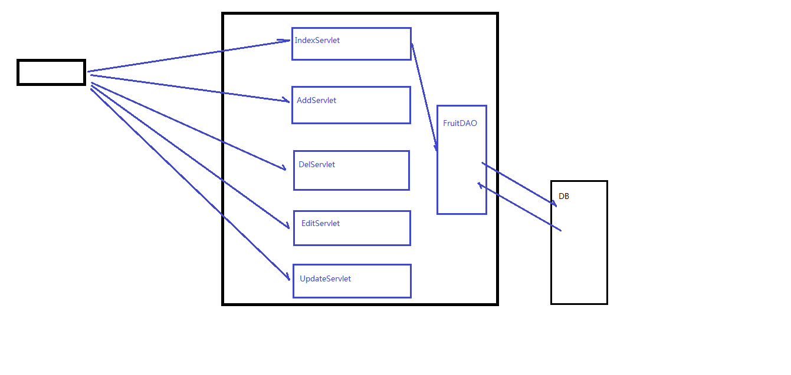
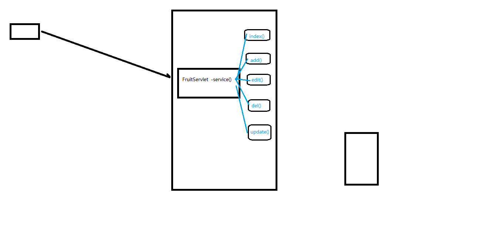
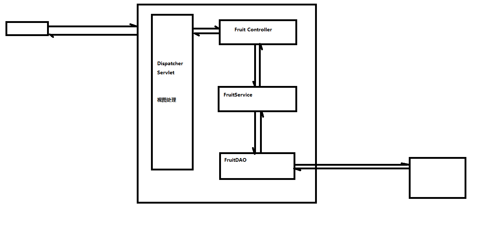
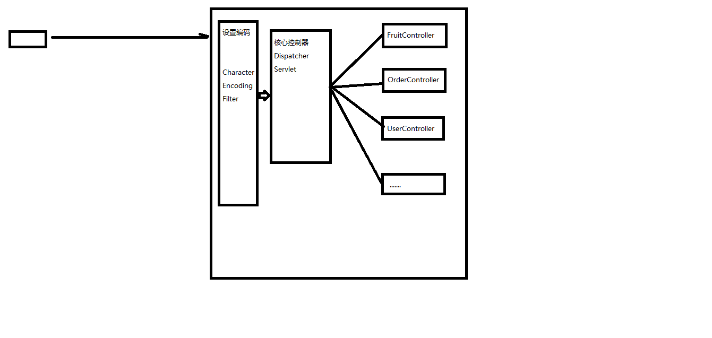
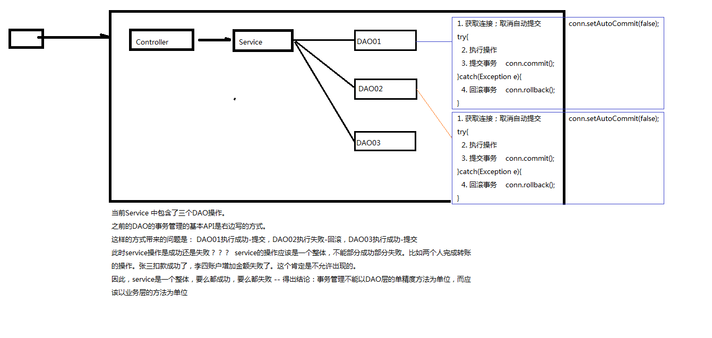
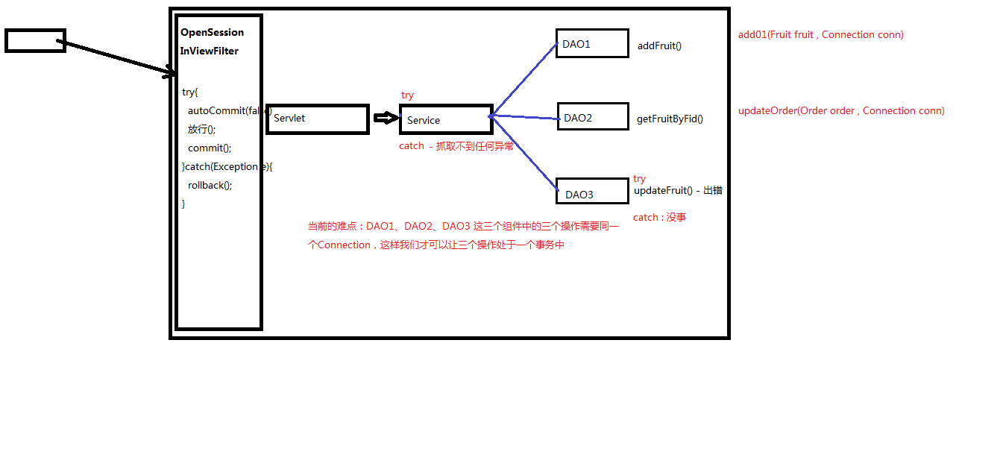
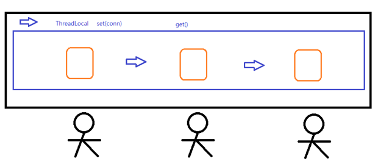

# JavaWeb后端

## CS和BS架构异同

CS：客户端服务器架构模式

* 优点：充分利用客户端机器的资源，减轻服务器的负荷
  
  一部分安全要求不高的计算任务存储在客户端执行，不需要把所有的计算和存储都在服务器端执行，从而减轻服务器的压力，也能够减轻网络负荷

* 缺点：需要安装；升级维护成本较高

BS：浏览器服务器架构模式

* 优点：客户端不需要安装，维护成本较低
* 缺点：所有的计算和存储任务都是放在服务器端的，服务器的负荷较重；在服务端计算完成之后再把结果在传输到客户端，因此客户端和服务器端会进行非常繁重的数据通信，从而网络负荷叫较重

## Tomcat

### Tomcat简单配置

首先打开 [Tomcat官网](https://tomcat.apache.org/) 下载对应的版本，将下载的文件解压缩到保存的路径下，记住这个路径`tomcat-path`

然后配置环境变量：

* 新建一个系统变量`CATALINA_HOME`，变量值为之前解压后`Tomcat`文件的路径
* 找到`Path`添加一个`%CATALINA_HOME%\bin`

然后打开`cmd`命令行窗口，输入`startup.bat`，然后打开网页 [localhost:8080](http://127.0.0.1:8080/)

### Tomcat简单介绍

Tomcat叫做 `WebContainer`，相当于是一个容器

目录结构：

* `bin` 可执行文件目录
* `conf `配置文件目录
* `lib `存放lib的目录
* `logs` 日志文件目录
* `webapps` 项目部署的目录
* `work` 工作目录
* `temp` 临时目录

> 配置环境变量，让`tomcat`能够运行，因为`tomcat`也是`java`和`c`来写的，因此需要配置`JAVA_HOME`

**启动`Tomcat`**，打开cmd命令行窗口，输入

```shell
startup.bat
```

### Tomcat部署

手动新建，在`webapps`中新建一个文件夹，将项目相关文件放在该新建文件夹中

### IDEA部署

IDEA部署总是有中文乱码，参考这篇文章解决了 

[【已解决】关于IDEA中 Tomcat 控制台打印日志中文乱码的解决 - 胖琛 - 博客园 (cnblogs.com)](https://www.cnblogs.com/yanglichen/p/11435628.html)

> IDEA部署的位置在当前工程的`out`文件夹下

## Servlet

* 获取用户(客户端)发给我的数据
* 调用DAO中的方法完成添加功能
* 在控制台打印添加成功

> `DAO`是数据访问层
> 
> `Service`是业务层

在IDEA中的操作步骤：

* 新建项目->新建模块
* 在模块中添加web
* 创建artifact-部署包
* 可以通过`<welcome-file-list>`标签进行设置欢迎页，在`tomcat`的`web.xml`中设置，或者在自己项目中的`web.xml`中设置

> 如果遇到`405`问题，表示当前请求的方法不支持

在`WEB-INF/web.xml`中添加路由

```xml
<servlet>
    <servlet-name>Demo01Servlet</servlet-name>
    <servlet-class>com.madao.servlets.Demo01Servlet</servlet-class>
</servlet>
<servlet-mapping>
    <servlet-name>Demo01Servlet</servlet-name>
    <url-pattern>/demo01</url-pattern>
</servlet-mapping>
```

`Servlet3.0`开始支持**注解**：`@WebServlet`

### 编码设置

#### POST方式

在表单输入中文之后，设置断点查看获得的数据为乱码


在获取`request`参数之前设置其编码

```java
request.setCharacterEncoding("UTF-8");
```

这样解决了乱码问题


#### GET

如果是`get`请求发送的中文数据，在`tomcat8`之前转码稍微有点麻烦：

* 需要首先将字符串打散成字节数组
* 然后将字节数组按照设定的编码重新组装成字符串

```java
String fname = request.getParameter("fname");
byte[] bytes = fname.getBytes("ISO-8859-1");
fname = ne wString(bytes, "UTF-8");
```

> 目前大多数使用的都是`tomcat8`，不用进行以上的操作

### 继承关系

* `javax.servlet.Servlet`接口
* `javax.servlet.GenericServlet`抽象类
* `javax.servlet.http.HttpServlet`抽象子类

相关方法

`javax.servlet.Servlet`接口：

* `void init(config)` 初始化方法
* `void service(request, response)` 服务方法
* `void destory()` 销毁方法

`javax.servlet.GenericServlet`抽象类

* `void service(request, response)` 仍然是抽象的

`javax.servlet.http.HttpServlet` 抽象子类

```java
protected void service(HttpServletRequest req, HttpServletResponse resp) throws ServletException, IOException {
        String method = req.getMethod();
        long lastModified;
        if (method.equals("GET")) {
            lastModified = this.getLastModified(req);
            if (lastModified == -1L) {
                this.doGet(req, resp);
            } else {
                long ifModifiedSince;
                try {
                    ifModifiedSince = req.getDateHeader("If-Modified-Since");
                } catch (IllegalArgumentException var9) {
                    ifModifiedSince = -1L;
                }

                if (ifModifiedSince < lastModified / 1000L * 1000L) {
                    this.maybeSetLastModified(resp, lastModified);
                    this.doGet(req, resp);
                } else {
                    resp.setStatus(304);
                }
            }
        } else if (method.equals("HEAD")) {
            lastModified = this.getLastModified(req);
            this.maybeSetLastModified(resp, lastModified);
            this.doHead(req, resp);
        } else if (method.equals("POST")) {
            this.doPost(req, resp);
        } else if (method.equals("PUT")) {
            this.doPut(req, resp);
        } else if (method.equals("DELETE")) {
            this.doDelete(req, resp);
        } else if (method.equals("OPTIONS")) {
            this.doOptions(req, resp);
        } else if (method.equals("TRACE")) {
            this.doTrace(req, resp);
        } else {
            String errMsg = lStrings.getString("http.method_not_implemented");
            Object[] errArgs = new Object[]{method};
            errMsg = MessageFormat.format(errMsg, errArgs);
            resp.sendError(501, errMsg);
        }

    }
```

* `void service(request, response)` 不是抽象的
  * `String method = req.getMethod();` 获取请求的方式
  * 各种`if`判断，根据请求方式不同，决定去调用不同的`do`方法
  * 在`HttpServlet`这个抽象类中，`do`方法都差不多

> * 继承关系：`HttpServlet`->`GenericServlet`->`Servlet`
> 
> * `Servlet`中的核心方法：`init()`，`service()`，`destroy()`
> 
> * 服务方法：当有请求过来时，`service`方法会自动响应，其实是`tomcat`容器调用的
>   
>   * 在`HttpServlet`中我们会分析请求的方式：到底是`get`、`post`、`head`还是`delete`等等
>   
>   * 然后再决定调用时哪个`do`开头的方法
>   
>   * 那么在`HttpSevlet`中这些`do`方法默认都是`405`的实现风格，需要我们子类去实现对应的方法
> 
> * 因此，我们在新建`Servlet`时，我们才会考虑请求方法，从而决定重写哪个`do`方法


### 生命周期

生命周期：从出生到死亡的过程，对应`Servlet`三个方法:`init()`，`service()`，`destroy()`

默认情况下：

* 第一次接受请求时，`Servlet`会进行实例化（调用构造方法，使用反射进行实例化）、初始化（调用`init()`）、然后服务（调用`service()`）
* 第二次请求开始，每一次都是服务
* 当容器关闭时，其中的所有`servlet`实例会被销毁，调用销毁方法

通过案例发现

* `Servlet`实例只会创建一个，其他的请求都是这个实例去响应
* 默认情况下，第一次请求时，`tomcat`才会去实例化，初始化，然后再服务

> * 这样的好处主要是，提高系统的启动速度
> * 缺点是：第一次请求时，启动速度较慢

`Servlet`的初始化时机：

* 默认是第一次初始化、实例化
* 我们可以通过`<load-on-startup>`来设置`Servlet`的启动顺序，数字越小，启动顺序越靠前，最小值0

```xml
<servlet>
    <servlet-name>Demo02Servlet</servlet-name>
    <servlet-class>com.madao.servlets.Demo02Servlet</servlet-class>
    <load-on-startup>1</load-on-startup>
</servlet>
```

`Servlet`在容器中是：单例的、线程不安全的

* 单例：所有的请求都是同一个实例去响应
* 线程不安全：一个线程需要根据这个实例中的某个成员变量值去做逻辑判断，但是在中间某个时机，另一个线程改变了这个成员变量的值，从而导致第一个线程的执行路径发生了变化
* 所以尽量不要在`servlet`中定义成员变量，或者如果定义了成员变量，不要通过成员变量的值去做一些逻辑运算

### 保存作用域

* `page`
  
  页面级别，现在几乎不用

* `request`
  
  一次请求响应范围
  
  !

* `session`
  
  一次会话范围
  
  

* `application`
  
  一次应用范围
  
  

### 路径问题

* ==相对路径==  相对于当前文件的目录级别来设置路径，上一级目录用`../`
* ==绝对路径==  绝对路径添加一个根路径，类似于`http://localhost:8080/project/css/login.css`

> base标签`<base href="http://localhost:8080/pro10/" />`，作用是当前页面的所有路径都以这个为基础`<link href=css/shopping.css>`
> 
> 其中`thymeleaf`设置绝对路径是
> 
> ```html
> <link th:href="@{/css/shopping.css}"
> ```

## Http协议

* HTTP：**H**yper **T**ext **T**ransfer **P**rotocol超文本传输协议。HTTP最大的作用就是确定了请求和响应数据的格式。浏览器发送给服务器的数据：请求报文；服务器返回给浏览器的数据：响应报文。

* Http是==无状态==的
  
  * 服务器无法判断两次请求是同一个客户端发过来的，还是不同客户端发过来的。这样带来一个问题就是无法区分不同的用户之间的访问
  
  * 可以通过==会话跟踪技术==解决
    
    > * 客户端第一次发请求给服务器，服务器获取`session`，获取不到，则创建新的，然后响应给客户端
    > * 下次客户端给服务器发请求时，会把`sessionID`带给服务器，服务器就能获取到了，那么服务器就判断这一次请求和上一次是同一个客户端
    > * 常用API：
    >   * `request.getSession()`  获取当前的会话，没有则创建一个新的
    >   * `request.getSessionI(true)` 效果和不带参数相同
    >   * `request.getSession(false)` 获取当前会话，没有则返回`null`，不会创建新的
    >   * `session.getId()` 获取`sessionID`
    >   * `session.isNew()` 判断当前`session`是否是新的
    > * `session`的默认会话时间是半个小时

* Http请求包含**请求**和**响应**两个部分：

### Http请求

Http请求包含三个部分：

* **请求方式**
  
  * 访问地址
  * HTTP协议的版本

* **请求消息头**
  
  作用：通过具体的参数对本次请求进行详细的说明
  
  格式：键值对，键和值之间使用冒号隔开
  
  相对比较重要的请求消息头：
  
  | 名称             | 功能                         |
  | -------------- | -------------------------- |
  | Host           | 服务器的主机地址                   |
  | Accept         | 声明当前请求能够接受的『媒体类型』          |
  | Referer        | 当前请求来源页面的地址                |
  | Content-Length | 请求体内容的长度                   |
  | Content-Type   | 请求体的内容类型，这一项的具体值是媒体类型中的某一种 |
  | Cookie         | 浏览器访问服务器时携带的Cookie数据       |

* **请求体**
  
  作为请求的主体，发送数据给服务器。具体来说其实就是POST请求方式下的请求参数
  
  * `get`方式，没有请求题，但是有一个`queryString`
  * `post`方式，有请求体，`form data`
  * `json`方式，有请求体，`request payload`

### Http响应

响应同样也分为三个部分：

* **响应行**
  
  包含三个信息：
  
  * 协议
  * 响应状态码
  * 响应状态
  
  > ```http
  > HTTP/1.1 200 OK
  > ```

* **响应头**
  
  - 响应体的说明书。
  - 服务器端对浏览器端设置数据，例如：服务器端返回Cookie信息。
  
  | 名称               | 功能                           |
  | ---------------- | ---------------------------- |
  | `Content-Type`   | 响应体的内容类型                     |
  | `Content-Length` | 响应体的内容长度                     |
  | `Set-Cookie`     | 服务器返回新的Cookie信息给浏览器          |
  | `location`       | 在**重定向**的情况下，告诉浏览器访问下一个资源的地址 |

* 响应体
  
  响应的实际内容，服务器返回的数据主体，有可能是各种数据类型。
  
  - `HTML`页面
  - 图片
  - 视频
  - 以下载形式返回的文件
  - `CSS`文件
  - `JavaScript`文件

## Session保存作用域

`Session`保存作用域和具体的某一个`session`对应的

* 向当前`session`保存作用域保存一个数据`"lina"`，对应的key为`"uname"`
  
  `session.setAttribute("uname", "lina");`

* 从当前`session`保存作用域中获取指定的`key`，也就是`uname`，对应的value值
  
  `session.getAttribute("uname");`

>  保存重复的`key`会覆盖掉之前的`key`

## 服务器内部转发以及客户端重定向

* 服务器内部转向 `request.getRequestDispatcher("...").forward(request, response);`
  
  * 一次请求响应的过程，对于客户端而言，内部经过了多少次转发，客户端是不知道的
  * 地址栏没有变化
  
  

* 客户端重定向 `response.sendRedirect("...");`
  
  * 两次请求响应的过程，客户端肯定知道请求URL有变化
  * 地址栏有变化
  
  

## Thymeleaf视图模板技术

在`html`页面上加载java内存中的数据的过程称之为渲染`render`

* 添加`thymeleaf`的`jar`包

* 在`web.xml`文件中添加配置
  
  ```xml
  <context-param>
      <param-name>view-prefix</param-name>
      <param-value>/WEB-INF/view/</param-value>
  </context-param>
  <context-param>
      <param-name>view-suffix</param-name>
      <param-value>.html</param-value>
  </context-param>
  ```

* 新建一个`Servlet`类`viewBaseServlet`

* 使得我们的`Servlet`继承`ViewBaseServlet`

* 逻辑视图名称得到物理视图名称
  
  * 逻辑视图名称：`index`
  * 物理视图名称：`view-prefix` + 逻辑视图名称 + `view-suffix`
  * 所以真实的视图名称是 `/index.html`

* 使用`thymeleaf`的标签
  
  `th:if`, `th:unless`, `th:each`

## Servlet优化

* 最初的做法是：一个请求对应一个`servlet`，这样存在的问题是`servlet`太多了

* 把一些列的请求都对应一个`Servlet`，`IndexServlet/AddServlet/EditServlet/DelServlet/UpdateServlet`->合并为`FruitServlet`，通过`operate`的值来决定调用`FruitServlet`中的哪一个方法
  
  使用的`switch case`

* 在上一个版本中，`Servlet`中充斥着大量的`switch-case`，试想一下，随着我们的项目的业务规模扩大，那么会有很多的`Servlet`，也就意味着会有很多的`switch-case`，这是一种代码冗余
  
  因此，我们在`servlet`中使用了反射技术，我们规定`operate`的值和方法名一致，那么接收到`operate`的值是什么就表明我们需要调用对应的方法进行响应，如果找不到对应的方法，则抛异常

* 在上一个版本中我们使用了反射技术，但是其实还是存在一定的问题：每一个`servlet`中都有类似的反射技术的代码。因此继续抽取，设计了中央控制器类：`DispatcherServlet`
     `DispatcherServlet`这个类的工作分为两大部分：
  
  * 根据`url`==定位==到能够处理这个请求的controller组件：
    
    * 从`url`中提取`servletPath : /fruit.do -> fruit`
    
    * 根据fruit找到对应的组件:`FruitController `， 这个对应的依据我们存储在`applicationContext.xml`中
      
          `<bean id="fruit" class="com.atguigu.fruit.controllers.FruitController/>`
            通过DOM技术我们去解析XML文件，在中央控制器中形成一个`beanMap`容器，用来存放所有的`Controller`组件
    
    * 根据获取到的`operate`的值定位到我们`FruitController`中需要调用的方法
  
  * `Controller`组件中的==方法调用==：
    
    * 获取参数
      获取即将要调用的方法的参数签名信息: `Parameter[] parameters = method.getParameters();`
      通过`parameter.getName()`获取参数的名称；
      准备了`Object[] parameterValues` 这个数组用来存放对应参数的参数值
      另外，我们需要考虑参数的类型问题，需要做类型转化的工作。通过`parameter.getType()`获取参数的类型
    * 执行方法
      `Object returnObj = method.invoke(controllerBean , parameterValues);`
    * 视图处理
      `String returnStr = (String)returnObj;
      if(returnStr.startWith("redirect:")){
       ....
      }else if.....`

### 合并servlet

最开始的项目流程如下图所示：



如果可以把所有servlet整合到一起，只用一个servlet实现，其中包含不同的方法，根据不同的请求来调用不同的方法



### dispatcherServlet引入

所有的请求交给`DispatcherServlet`，根据请求不同定义到不同的`Servlet`上，然后`Servlet`再转到不同的方法上


## Servlet初始化

* `Servlet`的生命周期：实例化、初始化、服务、销毁

* `Servlet`中的初始化方法有两个：`init()` , `init(config)  `其中带参数的方法代码如下：
  
  ```java
  public void init(ServletConfig config) throws ServletException {
      this.config = config ;
      init();
  }
  ```
  
  另外一个无参的`init`方法如下：
  
  ```java
  public void init() throws ServletException {
  }
  ```
  
  如果我们想要在`Servlet`初始化时做一些准备工作，那么我们可以重写`init`方法

### 获取初始化配置

我们可以通过如下步骤去获取初始化设置的数据

- 获取`config`对象：`ServletConfig config = getServletConfig();`

- 获取初始化参数值：` config.getInitParameter(key);`

- 可以在`web.xml`文件中配置
  
  ```xml
  <servlet>
      <servlet-name>Demo01Servlet</servlet-name>
      <servlet-class>com.madao.servlet.Demo01Servlet</servlet-class>
      <init-param>
          <param-name>hello</param-name>
          <param-value>world</param-value>
      </init-param>
  
  </servlet>
  
  <servlet-mapping>
      <servlet-name>Demo01Servlet</servlet-name>
      <url-pattern>/demo01</url-pattern>
  </servlet-mapping>
  ```

- 也可以通过注解的方式
  
  ```java
  @WebServlet(urlPatterns = {"/demo01"},
              initParams = {
                  @WebInitParam(name="hello", value="world"),
                  @WebInitParam(name="madao", value="yangmuyi")
              })
  ```

### ServletContext

获取`ServletContext`，有很多方法：

* 在初始化方法中：
  
  ```java
  ServletContext servletContext = getServletContext();
  ```

* 在服务方法中，可以通过`request`对象来获取，也可以通过`session`来获取
  
  ```java
  request.getServletContext();
  session.getServletContext();
  ```

* 获取初始值
  
  ```java
  servletContext.getInitParameter();
  ```

## 业务层

### 什么是业务层

Model1和Model2
MVC : `Model`（模型）、`View`（视图）、`Controller`（控制器）
==视图层==：用于做数据展示以及和用户交互的一个界面
==控制层==：能够接受客户端的请求，具体的业务功能还是需要借助于模型组件来完成
==模型层==：模型分为很多种：有比较简单的`pojo/vo`(value object)，有业务模型组件，有数据访问层组件

1) `pojo/vo` : 值对象
2) `DAO `： 数据访问对象
3) `BO `： 业务对象

### 区分业务对象和数据访问对象

* `DAO`中的方法都是单精度方法或者称之为==细粒度方法==。什么叫单精度？==一个方法只考虑一个操作==，比如添加，那就是`insert`操作、查询那就是`select`操作....

* BO中的方法属于业务方法，而==实际的业务是比较复杂==的，因此业务方法的粒度是比较粗的，称作==粗粒度方法==
  
  注册这个功能属于业务功能，也就是说注册这个方法属于业务方法。
  
  那么这个业务方法中包含了多个`DAO`方法。也就是说注册这个业务功能需要通过多个`DAO`方法的组合调用，从而完成注册功能的开发。

> * 检查用户名是否已经被注册 - `DAO`中的`select`操作
> * 向用户表新增一条新用户记录 - `DAO`中的`insert`操作
> * 向用户积分表新增一条记录（新用户默认初始化积分100分） - `DAO`中的`insert`操作
> * 向系统消息表新增一条记录（某某某新用户注册了，需要根据通讯录信息向他的联系人推送消息） - `DAO`中的`insert`操作
> * 向系统日志表新增一条记录（某用户在某IP在某年某月某日某时某分某秒某毫秒注册） - `DAO`中的`insert`操作

## IOC

### 耦合/依赖

依赖指的是某某某离不开某某某
在软件系统中，层与层之间是存在依赖的。我们也称之为耦合。
我们系统架构或者是设计的一个原则是： **高内聚低耦合**。
**层内部的组成应该是高度聚合的，而层与层之间的关系应该是低耦合**的，最理想的情况0耦合（就是没有耦合）



### IOC-控制反转/DI-依赖注入

#### 控制反转

之前在`servlet`中，我们创建了`service`对象， `FruitServlet fruitServlet = new FruitServiceImpl();`

* 这句话如果出现在`servlet`中的某个方法内部，那么这个`fruitService`的作用域(生命周期)应该就是这个方法级别
* 如果这句话出现在`servlet`的类，也就是说`fruitService`是一个成员变量，那么这个`fruitService`的作用域应该就是这个`servlet`实例级别
* 之后在`applicationContext.xml`中定义了这些`fruitService`，然后解析这些`XML`，产生`fruitService`实例，存放在`beanMap`中，这个`beanMap`在一个`beanFactory`中，因此我们转移了之前的`service`实例,`dao`实例等等的生命周期，控制权从程序员转移到`BeanFactory`。这个现象称之为**控制反转**

#### 依赖注入

* 之前我们在控制层出现代码：`FruitService fruitService = new FruitServiceImpl();`，那么控制层和`service`层存在耦合

* 之后，我们将代码修改成`FruitService fruitService = null;`

  然后，在配置文件中配置：

  ```xml
  <bean id="fruit" class="FruitController">
  	<property name="fruitService" ref = "fruitService"/>
  </bean>
  ```

## filter过滤器

### filter的基础知识

1. `Filter`也属于`Servlet`规范

2) `Filter`开发步骤：新建类实现`Filter`接口，然后实现其中的三个方法：`init`、`doFilter`、`destroy`
   配置`Filter`，可以用注解`@WebFilte`r，也可以使用`xml`文件` <filter> <filter-mapping>`
   
3. `Filter`在配置时，和`servlet`一样，也可以配置通配符，例如` @WebFilter("*.do")`表示拦截所有以.`do`结尾的请求

4. **过滤器链**

   

   * 执行的顺序依次是：` A B C demo03 C2 B2 A2`
   * 如果采取的是注解的方式进行配置，那么**过滤器链的拦截顺序是按照全类名的先后顺序排序(字母的顺序)**的
   * 如果采取的是`xml`的方式进行配置，那么**按照配置的先后顺序进行排序**

   设置编码`filter`

   

### 事务管理

编程式事务管理



改进后的结构图




> * 当前难点：`DAO1`、`DAO2`、`DAO3`这三个组件中的三个操作需要同一个`Conncection`，这样我们才可以三个操作处于一个事务
>
>   * 可以使用传参的方式，传递`Connection`
>
>   * 使用`ThreadLocal`的方式
>
>     
>
>     


1) 涉及到的组件：
  - `OpenSessionInViewFilter`
  - `TransactionManager`
  - `ThreadLocal`
  - `ConnUtil`
  - `BaseDAO`

2) `ThreadLocal`
  - `get()` ,` set(obj)`

  - `ThreadLocal`称之为本地线程 。 我们可以通过`set`方法在当前线程上存储数据、通过`get`方法在当前线程上获取数据

  - `set`方法源码分析：
    
      ```java
      public void set(T value) {
          Thread t = Thread.currentThread(); //获取当前的线程
          ThreadLocalMap map = getMap(t);    //每一个线程都维护各自的一个容器（ThreadLocalMap）
          if (map != null)
              map.set(this, value);          //这里的key对应的是ThreadLocal，因为我们的组件中需要传输（共享）的对象可能会有多个（不止Connection）
      else
          createMap(t, value);           //默认情况下map是没有初始化的，那么第一次往其中添加数据时，会去初始化
    }
      ```

* `get`方法源码分析：

  ```java
  public T get() {
      Thread t = Thread.currentThread(); //获取当前的线程
      ThreadLocalMap map = getMap(t);    //获取和这个线程（企业）相关的ThreadLocalMap（也就是工作纽带的集合）
      if (map != null) {
          ThreadLocalMap.Entry e = map.getEntry(this);   //this指的是ThreadLocal对象，通过它才能知道是哪一个工作纽带
          if (e != null) {
              @SuppressWarnings("unchecked")
              T result = (T)e.value;     //entry.value就可以获取到工具箱了
              return result;
          }
      }
      return setInitialValue();
    }
  ```

  

2. 监听器
    1) `ServletContextListener `- 监听`ServletContext`对象的创建和销毁的过程
    2) `HttpSessionListener `- 监听`HttpSession`对象的创建和销毁的过程
    3) `ServletRequestListener `- 监听`ServletRequest`对象的创建和销毁的过程

    4) `ServletContextAttributeListener `- 监听`ServletContext`的保存作用域的改动(`add`,`remove`,`replace`)
    5) `HttpSessionAttributeListener` - 监听`HttpSession`的保存作用域的改动(`add`,`remove`,`replace`)
    6) `ServletRequestAttributeListener `- 监听`ServletRequest`的保存作用域的改动(`add`,`remove`,`replace`)

    7) `HttpSessionBindingListener `- 监听某个对象在`Session`域中的创建与移除
    8) `HttpSessionActivationListener `- 监听某个对象在`Session`域中的序列化和反序列化
3. `ServletContextListener`的应用 - `ContextLoaderListener`


