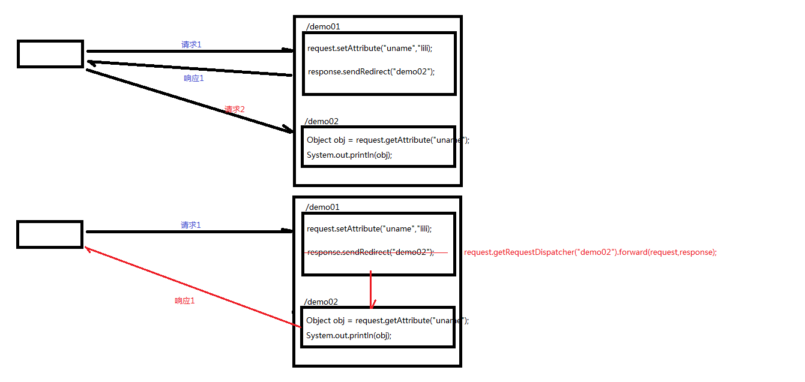

# JavaWeb后端

## CS和BS架构异同

CS：客户端服务器架构模式

* 优点：充分利用客户端机器的资源，减轻服务器的负荷

  一部分安全要求不高的计算任务存储在客户端执行，不需要把所有的计算和存储都在服务器端执行，从而减轻服务器的压力，也能够减轻网络负荷

* 缺点：需要安装；升级维护成本较高

BS：浏览器服务器架构模式

* 优点：客户端不需要安装，维护成本较低
* 缺点：所有的计算和存储任务都是放在服务器端的，服务器的负荷较重；在服务端计算完成之后再把结果在传输到客户端，因此客户端和服务器端会进行非常繁重的数据通信，从而网络负荷叫较重

## Tomcat

### Tomcat简单配置

首先打开 [Tomcat官网](https://tomcat.apache.org/) 下载对应的版本，将下载的文件解压缩到保存的路径下，记住这个路径`tomcat-path`

然后配置环境变量：

* 新建一个系统变量`CATALINA_HOME`，变量值为之前解压后`Tomcat`文件的路径
* 找到`Path`添加一个`%CATALINA_HOME%\bin`

然后打开`cmd`命令行窗口，输入`startup.bat`，然后打开网页 [localhost:8080](http://127.0.0.1:8080/)

### Tomcat简单介绍

Tomcat叫做 `WebContainer`，相当于是一个容器

目录结构：

* `bin` 可执行文件目录
* `conf `配置文件目录
* `lib `存放lib的目录
* `logs` 日志文件目录
* `webapps` 项目部署的目录
* `work` 工作目录
* `temp` 临时目录

> 配置环境变量，让`tomcat`能够运行，因为`tomcat`也是`java`和`c`来写的，因此需要配置`JAVA_HOME`

**启动`Tomcat`**，打开cmd命令行窗口，输入

```shell
startup.bat
```

### Tomcat部署

手动新建，在`webapps`中新建一个文件夹，将项目相关文件放在该新建文件夹中

### IDEA部署

IDEA部署总是有中文乱码，参考这篇文章解决了 

[【已解决】关于IDEA中 Tomcat 控制台打印日志中文乱码的解决 - 胖琛 - 博客园 (cnblogs.com)](https://www.cnblogs.com/yanglichen/p/11435628.html)

> IDEA部署的位置在当前工程的`out`文件夹下

## Servlet

* 获取用户(客户端)发给我的数据
* 调用DAO中的方法完成添加功能
* 在控制台打印添加成功

> `DAO`是数据访问层
>
> `Service`是业务层

在IDEA中的操作步骤：

* 新建项目->新建模块
* 在模块中添加web
* 创建artifact-部署包
* 可以通过`<welcome-file-list>`标签进行设置欢迎页，在`tomcat`的`web.xml`中设置，或者在自己项目中的`web.xml`中设置

> 如果遇到`405`问题，表示当前请求的方法不支持

在`WEB-INF/web.xml`中添加路由

```xml
<servlet>
    <servlet-name>Demo01Servlet</servlet-name>
    <servlet-class>com.madao.servlets.Demo01Servlet</servlet-class>
</servlet>
<servlet-mapping>
    <servlet-name>Demo01Servlet</servlet-name>
    <url-pattern>/demo01</url-pattern>
</servlet-mapping>
```

`Servlet3.0`开始支持**注解**：`@WebServlet`

### 编码设置

#### POST方式

在表单输入中文之后，设置断点查看获得的数据为乱码


在获取`request`参数之前设置其编码

```java
request.setCharacterEncoding("UTF-8");
```

这样解决了乱码问题


#### GET

如果是`get`请求发送的中文数据，在`tomcat8`之前转码稍微有点麻烦：

* 需要首先将字符串打散成字节数组
* 然后将字节数组按照设定的编码重新组装成字符串

```java
String fname = request.getParameter("fname");
byte[] bytes = fname.getBytes("ISO-8859-1");
fname = ne wString(bytes, "UTF-8");
```

> 目前大多数使用的都是`tomcat8`，不用进行以上的操作

### 继承关系

* `javax.servlet.Servlet`接口
* `javax.servlet.GenericServlet`抽象类
* `javax.servlet.http.HttpServlet`抽象子类

相关方法

`javax.servlet.Servlet`接口：

* `void init(config)` 初始化方法
* `void service(request, response)` 服务方法
* `void destory()` 销毁方法

`javax.servlet.GenericServlet`抽象类

* `void service(request, response)` 仍然是抽象的

`javax.servlet.http.HttpServlet` 抽象子类

```java
protected void service(HttpServletRequest req, HttpServletResponse resp) throws ServletException, IOException {
        String method = req.getMethod();
        long lastModified;
        if (method.equals("GET")) {
            lastModified = this.getLastModified(req);
            if (lastModified == -1L) {
                this.doGet(req, resp);
            } else {
                long ifModifiedSince;
                try {
                    ifModifiedSince = req.getDateHeader("If-Modified-Since");
                } catch (IllegalArgumentException var9) {
                    ifModifiedSince = -1L;
                }

                if (ifModifiedSince < lastModified / 1000L * 1000L) {
                    this.maybeSetLastModified(resp, lastModified);
                    this.doGet(req, resp);
                } else {
                    resp.setStatus(304);
                }
            }
        } else if (method.equals("HEAD")) {
            lastModified = this.getLastModified(req);
            this.maybeSetLastModified(resp, lastModified);
            this.doHead(req, resp);
        } else if (method.equals("POST")) {
            this.doPost(req, resp);
        } else if (method.equals("PUT")) {
            this.doPut(req, resp);
        } else if (method.equals("DELETE")) {
            this.doDelete(req, resp);
        } else if (method.equals("OPTIONS")) {
            this.doOptions(req, resp);
        } else if (method.equals("TRACE")) {
            this.doTrace(req, resp);
        } else {
            String errMsg = lStrings.getString("http.method_not_implemented");
            Object[] errArgs = new Object[]{method};
            errMsg = MessageFormat.format(errMsg, errArgs);
            resp.sendError(501, errMsg);
        }

    }
```

* `void service(request, response)` 不是抽象的
  * `String method = req.getMethod();` 获取请求的方式
  * 各种`if`判断，根据请求方式不同，决定去调用不同的`do`方法
  * 在`HttpServlet`这个抽象类中，`do`方法都差不多

> * 继承关系：`HttpServlet`->`GenericServlet`->`Servlet`
>
> * `Servlet`中的核心方法：`init()`，`service()`，`destroy()`
>
> * 服务方法：当有请求过来时，`service`方法会自动响应，其实是`tomcat`容器调用的
>
>   * 在`HttpServlet`中我们会分析请求的方式：到底是`get`、`post`、`head`还是`delete`等等
>
>   * 然后再决定调用时哪个`do`开头的方法
>   * 那么在`HttpSevlet`中这些`do`方法默认都是`405`的实现风格，需要我们子类去实现对应的方法
>
> * 因此，我们在新建`Servlet`时，我们才会考虑请求方法，从而决定重写哪个`do`方法


### 生命周期

生命周期：从出生到死亡的过程，对应`Servlet`三个方法:`init()`，`service()`，`destroy()`

默认情况下：

* 第一次接受请求时，`Servlet`会进行实例化（调用构造方法，使用反射进行实例化）、初始化（调用`init()`）、然后服务（调用`service()`）
* 第二次请求开始，每一次都是服务
* 当容器关闭时，其中的所有`servlet`实例会被销毁，调用销毁方法

通过案例发现

* `Servlet`实例只会创建一个，其他的请求都是这个实例去响应
* 默认情况下，第一次请求时，`tomcat`才会去实例化，初始化，然后再服务

> * 这样的好处主要是，提高系统的启动速度
> * 缺点是：第一次请求时，启动速度较慢

`Servlet`的初始化时机：

* 默认是第一次初始化、实例化
* 我们可以通过`<load-on-startup>`来设置`Servlet`的启动顺序，数字越小，启动顺序越靠前，最小值0

```xml
<servlet>
    <servlet-name>Demo02Servlet</servlet-name>
    <servlet-class>com.madao.servlets.Demo02Servlet</servlet-class>
    <load-on-startup>1</load-on-startup>
</servlet>
```

`Servlet`在容器中是：单例的、线程不安全的

* 单例：所有的请求都是同一个实例去响应
* 线程不安全：一个线程需要根据这个实例中的某个成员变量值去做逻辑判断，但是在中间某个时机，另一个线程改变了这个成员变量的值，从而导致第一个线程的执行路径发生了变化
* 所以尽量不要在`servlet`中定义成员变量，或者如果定义了成员变量，不要通过成员变量的值去做一些逻辑运算

### 保存作用域

* `page`

  页面级别，现在几乎不用

* `request`

  一次请求响应范围

  !

* `session`

  一次会话范围

  

* `application`

  一次应用范围
  
  

### 路径问题

* ==相对路径==  相对于当前文件的目录级别来设置路径，上一级目录用`../`
* ==绝对路径==  绝对路径添加一个根路径，类似于`http://localhost:8080/project/css/login.css`

> base标签`<base href="http://localhost:8080/pro10/" />`，作用是当前页面的所有路径都以这个为基础`<link href=css/shopping.css>`
>
> 其中`thymeleaf`设置绝对路径是
>
> ```html
> <link th:href="@{/css/shopping.css}"
> ```

## Http协议

* HTTP：**H**yper **T**ext **T**ransfer **P**rotocol超文本传输协议。HTTP最大的作用就是确定了请求和响应数据的格式。浏览器发送给服务器的数据：请求报文；服务器返回给浏览器的数据：响应报文。

* Http是==无状态==的

  * 服务器无法判断两次请求是同一个客户端发过来的，还是不同客户端发过来的。这样带来一个问题就是无法区分不同的用户之间的访问

  * 可以通过==会话跟踪技术==解决

    > * 客户端第一次发请求给服务器，服务器获取`session`，获取不到，则创建新的，然后响应给客户端
    > * 下次客户端给服务器发请求时，会把`sessionID`带给服务器，服务器就能获取到了，那么服务器就判断这一次请求和上一次是同一个客户端
    > * 常用API：
    >   * `request.getSession()`  获取当前的会话，没有则创建一个新的
    >   * `request.getSessionI(true)` 效果和不带参数相同
    >   * `request.getSession(false)` 获取当前会话，没有则返回`null`，不会创建新的
    >   * `session.getId()` 获取`sessionID`
    >   * `session.isNew()` 判断当前`session`是否是新的
    > * `session`的默认会话时间是半个小时

* Http请求包含**请求**和**响应**两个部分：

### Http请求

Http请求包含三个部分：

* **请求方式**

  * 访问地址
  * HTTP协议的版本

* **请求消息头**

  作用：通过具体的参数对本次请求进行详细的说明

  格式：键值对，键和值之间使用冒号隔开

  相对比较重要的请求消息头：

  | 名称           | 功能                                                 |
  | -------------- | ---------------------------------------------------- |
  | Host           | 服务器的主机地址                                     |
  | Accept         | 声明当前请求能够接受的『媒体类型』                   |
  | Referer        | 当前请求来源页面的地址                               |
  | Content-Length | 请求体内容的长度                                     |
  | Content-Type   | 请求体的内容类型，这一项的具体值是媒体类型中的某一种 |
  | Cookie         | 浏览器访问服务器时携带的Cookie数据                   |

* **请求体**

  作为请求的主体，发送数据给服务器。具体来说其实就是POST请求方式下的请求参数

  * `get`方式，没有请求题，但是有一个`queryString`
  * `post`方式，有请求体，`form data`
  * `json`方式，有请求体，`request payload`

### Http响应

响应同样也分为三个部分：

* **响应行**

  包含三个信息：

  * 协议
  * 响应状态码
  * 响应状态

  > ```http
  > HTTP/1.1 200 OK
  > ```

* **响应头**

  - 响应体的说明书。
  - 服务器端对浏览器端设置数据，例如：服务器端返回Cookie信息。

  | 名称             | 功能                                                 |
  | ---------------- | ---------------------------------------------------- |
  | `Content-Type`   | 响应体的内容类型                                     |
  | `Content-Length` | 响应体的内容长度                                     |
  | `Set-Cookie`     | 服务器返回新的Cookie信息给浏览器                     |
  | `location`       | 在**重定向**的情况下，告诉浏览器访问下一个资源的地址 |

* 响应体

  响应的实际内容，服务器返回的数据主体，有可能是各种数据类型。

  - `HTML`页面
  - 图片
  - 视频
  - 以下载形式返回的文件
  - `CSS`文件
  - `JavaScript`文件

## Session保存作用域

`Session`保存作用域和具体的某一个`session`对应的

* 向当前`session`保存作用域保存一个数据`"lina"`，对应的key为`"uname"`

  `session.setAttribute("uname", "lina");`

* 从当前`session`保存作用域中获取指定的`key`，也就是`uname`，对应的value值

  `session.getAttribute("uname");`

>  保存重复的`key`会覆盖掉之前的`key`

## 服务器内部转发以及客户端重定向

* 服务器内部转向 `request.getRequestDispatcher("...").forward(request, response);`

  * 一次请求响应的过程，对于客户端而言，内部经过了多少次转发，客户端是不知道的
  * 地址栏没有变化

  

* 客户端重定向 `response.sendRedirect("...");`

  * 两次请求响应的过程，客户端肯定知道请求URL有变化
  * 地址栏有变化

  

## Thymeleaf视图模板技术

在`html`页面上加载java内存中的数据的过程称之为渲染`render`

* 添加`thymeleaf`的`jar`包

* 在`web.xml`文件中添加配置

  ```xml
  <context-param>
      <param-name>view-prefix</param-name>
      <param-value>/WEB-INF/view/</param-value>
  </context-param>
  <context-param>
      <param-name>view-suffix</param-name>
      <param-value>.html</param-value>
  </context-param>
  ```

  

* 新建一个`Servlet`类`viewBaseServlet`

* 使得我们的`Servlet`继承`ViewBaseServlet`

* 逻辑视图名称得到物理视图名称

  * 逻辑视图名称：`index`
  * 物理视图名称：`view-prefix` + 逻辑视图名称 + `view-suffix`
  * 所以真实的视图名称是 `/index.html`

* 使用`thymeleaf`的标签

  `th:if`, `th:unless`, `th:each`

39-start


