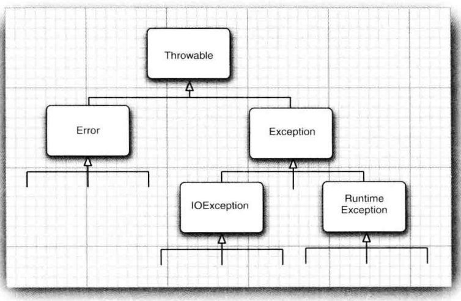

# 第7章 异常、断言和日志

## 7.1 处理错误

### 7.1.1 异常分类

下图是`Java`异常层次结构的一个简化示意图



* `Error`
  * 描述了`Java`运行时系统的内部错误和资源耗尽错误
* `Exception`
  * `RuntimeException`
    * 错误的类型转换。
    * 数组访问越界i
    * 访问`null`指针
  * 其他异常
    * 试图在文件尾部后面读取数据
    * 试图打开一个不存在的文件
    * 试图根据给定的字符串查找Class对象，而这个字符串表示的类并不存在

> 如果出现RuntimeException异常，那么就一定是你的问题

`Java`语言规范将派生于`Error`类或`RuntimeException`类的所有异常称为非受查(unchecked)异常，所有其他的异常称为受查（checked)异常

### 7.1.2 声明受查异常

如果一个方法可能会发生异常，应该在方法的首部声明可能抛出的异常，例如

```java
public FileInputStream(String name) throws FileNotFoundException
```

但是也不是所有可能抛出的异常都进行声明，一般在下面的4种情况下应该抛出异常：

1. 调用一个抛出受査异常的方法
2. 程序运行过程中发现错误
3. 程序出现错误，例如，`a[-l]=0`会抛出一个`ArraylndexOutOffloundsException`这样的非受查异常
4. Java虚拟机和运行时库出现的内部错误

如果一个方法有可能抛出多个受查异常类型，那么就必须在方法的首部列出所有的异常类。每个异常类之间用逗号隔开

```java
class MyAnimation
{
	// ...
    public Image loadImage(String s) throws FileNotFoundException, EOFException
    {
        // ...
    }
}
```

> 如果超类方法没有抛出任何受查异常，之类也不能抛出任何受查异常

### 7.1.3 如何抛出异常

有两种方式抛出异常

```java
// method 1
throw new EOFException();
// method 2
EOFException e = new EOFException();
throw e;
```

### 7.1.4 创建异常类

可能会遇到标准异常类无法充分描述清楚的问题，这种情况，创建自己的异常类就是一件顺理成章的事情。

定义一个派生于`Exception`的类，或者派生于`Exception`之类的类，定义的类应该包含两个构造器：

* 一个是默认的构造器
* 另一个是带有详细描述信息的构造器

```java
class FileFormatException extends IOException
{
    public FileFormatException() {}
    public FileFormatException(String gripe)
    {
        super(gripe);
    }
}
```

## 7.2 捕获异常

抛出异常之后？当然，还需要捕获异常

### 7.2.1 捕获异常

如果某个异常发生的时候没有在任何地方进行捕获，那程序就会终止执行，并在控制台上打印出异常信息，其中包括异常的类型和堆栈的内容

对于图形界面程序，捕获异常之后，也会打印出堆桟的信息，但程序将返回到用户界面的处理循环中

捕获异常，需要设置`try/catch`语句块

```java
try
{
    //code  
}
catch(ExceptionType e)
{
    // handler for this type
}
```

`try/catch`的执行顺序：

* `try`语句块中的任何代码抛出了一个在`catch`子句中说明的异常类
  * 程序将跳过`try`语句块的其余代码
  * 程序将执行`catch`子句中的处理器代码
* 如果在`try`语句块中的代码没有拋出任何异常，那么程序将跳过`catch`子句
* 拋出了一个在`catch`子句中没有声明的异常类型，那么这个方法就会立刻退出

>  如果编写一个覆盖超类的方法，而这个方法又没有抛出异常（如JComponent中的paintComponent),那么这个方法就必须捕获方法代码中出现的每一个受查异常。不允许在子类的throws说明符中出现超过超类方法所列出的异常类范围。

### 7.2.2 捕获多个异常

在一个`try`语句块中可以捕获多个异常类型，要想获得对象的更多信息，可以试着使用`e.getMessage()`，或者使用`e.getClass().getName()`得到异常对象的实际类型，而且同一个`catch`子句可以捕获多个异常类型

```java
try
{
    // code that might throw exceptions
}
catch(FileNotFoundException | UnKnownHostException e)
{
    // emergency action for missing files and unknown hosts
}
catch(IOException e)
{
    // emergency action for all other I/O problems
}
```

> * 捕获多个异常时，异常变量隐含为`final`变量
> * 获多个异常不仅会让你的代码看起来更简单，还会更高效。生成的字节码只包一个对应公共1子句的代码块

### 7.2.3 再次抛出异常与异常链

在`catch`子句中可以抛出一个异常，这样做的目的是改变异常的类型，或者另一种方法是将原始异常设置为新异常的原因

```java
try
{
    //access the database
}
catch(SQLException e)
{
    Throwable se = new ServletException("database error");
    se.initCause(e);
    throw se;
}
```

### 7.2.4 `finally`子句

不管是否有异常被捕获，`finally`子句中的代码都被执行

```java
try
{
    // code that might throw exceptions
}
catch(IOException e)
{
    // emergency action for all other I/O problems
}
finally
{
	in.close();
}
```

当`finally`子句包含`return`语句时，将会出现一种意想不到的结果„假设利用`return`语句从`try`语句块中退出。在方法返回前，`finally`子句的内容将被执行。如果`finally`子句中也有一个`return`语句，这个返回值将会覆盖原始的返回值

```java
public static int f(int n)
{
    try
    {
        int r = n * n;
        return r;
    }
    finally
    {
        if(n == 2) return 0;
    }
}
```

如果调用`f(2)`,那么`try`语句块的计算结果为`r=4`,并执行`return`语句，然而，在方法真正返回前，还要执行`finally`子句。`finally`子句将使得方法返回`0`,这个返回值覆盖了原始的返回值`4`

### 7.2.5 带资源的`try`语句

一般释放资源的形式

```java
// open a resource
try
{
    // work with the resource
}
finally
{
    // close the resource
}
```

假设资源属于一个实现了`AutoCloseable`接口的类，`JavaSE7`为这种代码模式提供了一个很有用的快捷方式

```java
void close() throws Exception

try(Resource res = ...)
{
    wotk with res
}
```

上述代码是`try-with-resources`的最简形式，`try`块退出后，会自动调用`res.close()`

### 7.2.6 分析堆栈轨迹元素

* 堆栈轨迹（`stacktrace`)是一个方法调用过程的列表，它包含了程序执行过程中方法调用的特定位置

* 可以调用`Throwable`类的`printStackTrace`方法访问堆栈轨迹的文本描述信息

  ```java
  Throwable t = new Throwable();
  StringWriter out = new StringWriter();
  t.printStackTrace(new PrintWriter(out));
  String description = out.toString();
  ```
  
* 一种更灵活的方法是使用`getStackTrace`方法，它会得到`StackTraceElement`对象的一个数组

  ```java
  Throwable t = new Throwable();
  StackTraceElement[] frames = t.getStackTrace();
  for(StackTraceElement frame: frames)
      // analyze frame
  ```
  
* 静态的`Thread.getAllStackTrace`方法，它可以产生所有线程的堆栈轨迹

  ```java
  Map<Thread, StackTraceElement[]> map = Thread.getAllStackTraces();
  for(Thread t: map.keySet())
  {
      StackTraceElement[] frames = map.get(t);
      // analyze
  }
  ```
  

## 7.3 使用异常机制的技巧

1. 异常处理不能代替简单的测试

   与执行简单的测试相比，捕获异常所花费的时间大大超过了前者

2. 不要过分地细化异常

3. 利用异常层次结构

4. 不要压制异常

5. 在检测错误时，“苛刻“要比放任更好

6. 不要羞于传递异常

## 7.4 使用断言

### 7.4.1 断言的概念

断言机制允许在测试期间向代码中插入一些检查语句，当代码发布时，这些插入的检测语句就会被自动地移走

```java
assert 条件;

assert 条件: 表达式;
```

表达式将被传入`AssertionError`的构造器，并转换成一个消息字符串

### 7.4.2 启用和禁用断言

在默认情况下，断言被禁用。可以在运行程序时用`-enableassertions`或`-ea`选项启用

```java
java -enableassertions MyApp
```

启用或禁用断言时不必重新编译程序。启用或禁用断言是类加载器(classloader)的功能

### 7.4.3 使用断言完成参数检查

什么时候使用断言：

* 断言失败是致命的、不可恢复的错误
* 断言检测只用于开发和测试阶段


