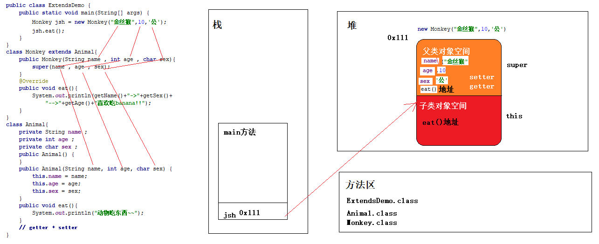

# Java进阶简介

主要的知识点来自于黑马程序员的视频：`BV1TE41177mP`

[TOC]

# day1-复习回顾、静态、继承、引用类型使用

## 定义类

- 类名的首字母应该大写，满足**驼峰写法**
- 一个Java文件可以定义多个类。但是只有一个类是用`public`修饰，`public`修饰的类名必须称为`Java`文件名。

- 类中有且仅有5大成分（五大金刚）

  - **成员变量Field**：描述类或者对象的属性信息的。
  - **成员方法Method**：描述类或者对象的行为的。
  - **构造器（构造方法,Constructor）**: 初始化类的一个对象返回。
    - 有参构造器
    - 无参构造器
  - **代码块**

  - **内部类**

## 封装

- 面向对象的三大**特征**之一：**封装，继承，多态**。 
- 形成了规范，即使毫无意义还是会这样写代码！
- 合理隐藏，合理暴露。
- 封装的规范：成员变量私有，方法一般公开，提供成套的`getter`和`setter`方法暴露成员变量的取值和赋值，`public`修饰符
- 封装的作用：提高安全性，提高代码的组件化思想。
- 封装已经成为`Java`代码的规范，即使毫无意义，我们也要这样写代码（成员变量私有，方法公开）

## this关键字

- `this`代表了当前对象的引用。
- `this`可以出现在构造器和方法中。
- `this`出现在构造器中代表构造器正在初始化的对象。
- `this`出现在方法中，哪个对象调用方法，`this`就代表哪个对象。
- `this`可以访问对象的成员变量，区分成员变量是局部的还是对象中的成员变量。

## static关键字

`Java`是通过成员变量是否有`static`修饰来区分是类的还是属于对象的

* 没有`static`修饰的方法和变量是属于每个对象的
* 有`static`修饰的方法和成员变量属于类的

按照有无`static`修饰，成员变量和方法可以分为：

**成员变量**：

* **静态成员变量**（类变量）：有`static`修饰的成员变量称为静态成员变量也叫类变量，属于类本身的，**直接用类名访问**即可。
* **实例成员变量**：无`static`修饰的成员变量称为实例成员变量，属于类的每个对象的，**必须用类的对象来访问**。

> * 同一个类中访问静态成员变量可以省略类名不写
> * 对象也可以访问静态成员变量，但是不推荐，静态成员变量属于类，如果用对象访问静态成员变量容易混淆

成员变量访问内存


```java
public class Student{
    // 1.静态成员变量:有static修饰，属于类本身，直接用类名访问即可！
    public static String schoolName = "黑马";
    // 2.实例成员变量:无static修饰，属于类的对象的，必须用对象访问！
    private String name;
    private int age ;

    public static void main(String[] args) {
        // 1.类名.静态成员变量
        System.out.println(Student.schoolName);
        // 注意：同一个类中访问静态成员变量可以省略类名不写
        System.out.println(schoolName);

        // 2.对象.实例成员变量
        //System.out.println(Student.name); // 报错！
        Student swk = new Student();
        swk.name = "孙悟空";
        System.out.println(swk.name);
        System.out.println(swk.age);

        // 3.对象.静态成员变量(不推荐)
        // 静态成员变量属于类，直接用类名访问即可。
        System.out.println(swk.schoolName);
    }
}
```

**成员方法**：

* **静态方法**：有`static`修饰的成员方法称为静态方法也叫类方法，属于类本身的，**直接用类名访问**即可。
* **实例方法**：无`static`修饰的成员方法称为实例方法，属于类的每个对象的，**必须用类的对象**来访问。

> * 静态方法属于类，有static修饰，直接用类名访问即可。
> * 实例方法属于对象，无static修饰，必须先创建对象，然后用对象来访问。
> * 静态方法也可以被对象共享访问，但是不推荐，因为静态方法直接用类名访问即可。


```java
public class Student {
    // 0.实例成员变量。
    private String name;
    private int age ;

    // 1.静态方法：有static修饰，属于类，直接用类名访问即可！
    public static void inAddr(){
        System.out.println("我们都在天河区吉山村happy的学习Java!");
    }

    // 2.实例方法：无static修饰，属于对象，必须用对象访问！
    public void eat(){
        System.out.println(name + "已经"+age+"岁，在吃好吃的！！");
    }

    public static void main(String[] args) {
        // a.类名.静态方法
        Student.inAddr();
        // 注意：在同一个类中访问静态成员可以省略类名不写！！
        inAddr();

        // b.对象.实例方法
        // Student.eat(); // 报错了！
        Student zbj = new Student();
        zbj.name = "猪刚鬣";
        zbj.age = 1000;
        zbj.eat();

        // c.对象.静态方法(不推荐)
        zbj.inAddr();
    }
}
```

关于`static`常考的八类题：

* 实例方法是否可以直接访问实例成员变量？可以的，因为它们都属于对象。
* 实例方法是否可以直接访问静态成员变量？可以的，静态成员变量可以被共享访问。
* 实例方法是否可以直接访问实例方法? 可以的，实例方法和实例方法都属于对象。
* 实例方法是否可以直接访问静态方法？可以的，静态方法可以被共享访问！
* 静态方法是否可以直接访问实例变量？ 不可以的，实例变量必须用对象访问！！
* 静态方法是否可以直接访问静态变量？ 可以的，静态成员变量可以被共享访问。
* 静态方法是否可以直接访问实例方法? 不可以的，实例方法必须用对象访问！！
* 静态方法是否可以直接访问静态方法？可以的，静态方法可以被共享访问！！

> **也就是说实例方法啥都可以访问，静态方法只能访问静态方法或者静态变量**

## 继承

### 继承的概述

面向对象的三大特征：封装、继承和多态

继承是Java中一般到特殊的关系，是一种子类到父类的关系。例如：学生类继承了人类。  猫类继承了动物类。

被继承的类称为：父类/超类。继承父类的类称为：子类

* 继承可以**提高代码的复用性**
* 子类直接继承父类，就可以直接使用父类的这些代码了（相同代码重复利用）

子类继承了一个父类，子类就可以直接得到父类的属性（成员变量）和行为（方法）了。

### 继承的例子

```java
class Animal{

}

class Cat extends Animal{

}
```

> - 继承的优势可以把相同的代码定义在父类中，子类可以直接继承使用。
> - 这样就可以**提高代码的复用性**：相同代码只需要在父类中写一次就可以了。

### 子类不能继承父类的内容

- 子类继承父类，子类就得到了父类的属性和行为。
- 但是并非所有父类的属性和行为等子类都可以继承。

**子类不能继承父类的东西**：子类不能继承父类的构造器，子类有自己的构造器。（没有争议的）

有争议的观点（拓展）：

**子类是否可以继承父类的私有成员**（私有成员变量，私有成员方法）?

* **子类是可以继承父类的私有成员的，只是不能直接访问而已**。
* 以后可以暴力去访问继承自父类的私有成员~~~

**子类是否可以继承父类的静态成员？**

* **子类是不能继承父类的静态成员的**
* **子类只是可以访问父类的静态成员**，父类的静态成员只有一份可以被子类共享访问。
* **共享并非继承**

### 成员变量的访问特点

**就近原则**：子类有找子类，子类没有找父类，父类没有就报错

```java
class Animal{
    public String name = "动物名称";
}

class Cat extends Animal{
    public String name = "子类名称";
    public void show(){
        String name = "局部名称";
        System.out.println(name); // 局部名称
        System.out.println(this.name); // 子类名称
        System.out.println(super.name); // 父类名称
    }
}
```

> - `this`代表了当前对象的引用，可以用于访问当前子类对象的成员变量。
> - `super`代表了父类对象的引用，可以用于访问父类中的成员变量。

### 成员方法的访问特点

就近原则：子类有找子类，子类没有找父类，父类没有就报错

子类对象优先使用子类已有的方法，也就是说父类的方法被重写

```java
public class TestDemo {
    public static void main(String[] args) {
        Cat cat = new Cat();
        cat.run(); // 子类的
        cat.eat(); // 父类的
        // cat.go(); // 报错！
    }
}

class Animal{
    public void run(){
        System.out.println("动物可以跑~~~~");
    }

    public void eat(){
        System.out.println("吃东西~~~~");
    }
}

class Cat extends Animal {
    public void run(){
        System.out.println("🐱跑的贼溜~~~~");
    }
}
```

### 方法重写

子类继承了父类，子类就得到了父类的某个方法。但是子类觉得父类的这个方法不好用或者无法满足自己的需求，子类重写一个与父类申明一样的方法来覆盖父类的该方法，子类的这个方法就进行了方法重写。

方法重写的校验注解： `@Override`

- `Java`建议在重写的方法上面加上一个`@Override`注解。
- 方法一旦加了这个注解，那**就必须是成功重写父类**的方法，否则报错！
- `Override`优势：**可读性好，安全，优雅**

方法重写的具体要求：

* 子类重写方法的**名称和形参列表必须与父类被重写方法一样**。
* 子类重写方法的返回值类型申明要么与父类一样，要么比父类方法**返回值类型范围更小**。（以后再了解）
* 子类重写方法的修饰符权限应该与父类被重写方法的**修饰符权限相同或者更大**。（以后再了解）
* 子类重写方法申明抛出的异常应该与父类被重写方法申明抛出的**异常一样或者范围更小**！（以后再了解）

```java
class Wolf extends Animal{
    // 进行了方法重写！！
    // 子类重写方法的名称和形参列表必须与父类被重写方法一样
    // 子类重写方法的返回值类型申明要么与父类一样，要么比父类方法返回值类型范围更小
    // 子类重写方法的修饰符权限应该与父类被重写方法的修饰符权限相同或者更大
    @Override
    public void run(){
        System.out.println("🐺跑的贼快~~~");
    }
}

class Animal{
    public void run(){
        System.out.println("动物可以跑步~~~");
    }
}
```

> - 方法重写是子类重写一个与父类申明一样的方法覆盖父类的方法。
> - 方法重写建议加上`@Override`注解。
> - 方法重写的核心要求：方法名称形参列表必须与被重写方法一致！！
> - 建议**申明不变，重新实现**。

调用父类被重写的方法使用`super`

```java
class SportMan extends People{
    @Override
    public void run(){
        System.out.println("运动员跑的贼快~~~~~");
    }

    public void go(){
        super.run(); // 父类被重写的方法
        run(); // 子类的
    }
}

class People{
    public void run(){
        System.out.println("人会跑~");
    }
}
```

> `super`可以用在子类的实例方法中调用父类被重写的方法

静态方法和私有方法**不可以**被重写

```java
class Mac extends Computer{
//    @Override
    public void go(){
    }

    // @Override
    public static void test(){
    }
}

class Computer{
    public static void test(){
        System.out.println("super test");
    }

    private void go(){

    }
}
```

### 继承后构造器的特点

子类的全部构造器默认一定会**先访问父类的无参数构造器，再执行子类自己的构造器**，主要的原因是

* 子类的构造器的第一行默认有一个`super()`调用父类的无参数构造器，写不写都存在
* 子类继承父类，子类就得到了父类的属性和行为
* 当我们调用子类构造器初始化子类对象数据的时候，必须先调用父类构造器初始化继承自父类的属性和行为

### super调用父类构造器

`super(...)`可以根据参数选择调用父类的某个构造器

```java
class Monkey extends Animal{

    public Monkey(String name, int age, char sex) {
        super(name , age , sex) ; // 根据参数匹配调用父类构造器
    }

    public void eatBanana(){
        System.out.println(getName()+"-->"+getAge()+"-->"+getSex()+"在吃🍌~~~");
    }
}

class Animal{
    private String name;
    private int age;
    private char sex;

    public Animal() {
    }

    public Animal(String name, int age, char sex) {
        this.name = name;
        this.age = age;
        this.sex = sex;
    }

    public String getName() {
        return name;
    }

    public void setName(String name) {
        this.name = name;
    }

    public int getAge() {
        return age;
    }

    public void setAge(int age) {
        this.age = age;
    }

    public char getSex() {
        return sex;
    }

    public void setSex(char sex) {
        this.sex = sex;
    }
}
```

`super`调用父类构造器的内存分布图



### this和super关键字使用总结

`this`代表了当前对象的引用（继承中指代子类对象）：

* `this` 子类成员变量
* `this`子类成员方法
* `this(...)` 可以根据参数匹配访问本类其他构造器

`super`代表了父类对象的引用（继承中指代了父类对象空间）

* `super` 父类成员变量
* `super`父类的成员方法
* `super(...)`可以根据参数匹配访问父类的构造器

`this(...)`和`super(...)`**必须放在构造器的第一行**，否则报错

所以`this(...)`和`super(...)`**不能同时出现在构造器中**

```java
class Student{
    private String name ;
    private int age ;
    private String schoolName ;

    public Student() {
    }

    public Student(String name , int age){
        // 借用兄弟构造器的功能！
        this(name , age , "黑马");
    }

    public Student(String name, int age, String schoolName) {
        this.name = name;
        this.age = age;
        this.schoolName = schoolName;
    }

    public String getName() {
        return name;
    }

    public void setName(String name) {
        this.name = name;
    }

    public int getAge() {
        return age;
    }

    public void setAge(int age) {
        this.age = age;
    }

    public String getSchoolName() {
        return schoolName;
    }

    public void setSchoolName(String schoolName) {
        this.schoolName = schoolName;
    }
}
```

### 继承的特点

* **单继承**：一个类只能继承一个直接父类

  * 如果是多继承可能会出现类的**二义性**

    ```java
    class A{
        public void test(){
            System.out.println("A");
        }
    }
    class B{
        public void test(){
            System.out.println("B");
        }
    }
    class C extends A , B {
        public static void main(String[] args){
            C c = new C();
            c.test(); // 出现了类的二义性！所以Java不能多继承！！
        }
    }
    ```

* **多层继承**：一个类可以间接继承多个父类

* 一个类可以有多个子类

* 一个类要么默认继承了`Object`类，要么间接继承了`Object`类，`Object`类是`Java`的祖宗类

## 引用类型作为方法参数和返回值

* 除了基本数据类型都是引用数据类型
* 引用类型可以作为方法的参数类型和返回值类型
* 引用数据类型可以在一切可以使用类型的地方使用

```java
public class TestDemo {
    public static void main(String[] args) {
        Dog jinMao = new Dog();
        go(jinMao);

        System.out.println("--------------");
        Dog dog = createDog();
        dog.run();
    }

    // 引用类型作为方法的返回值:创建一个狗对象返回！
    public static Dog createDog(){
//        Dog taiDi = new Dog();
//        return taiDi;
         return new Dog();
    }

    // 引用类型作为方法参数: 提供一个方法让狗进入比赛~~~
    public static void go(Dog a){
        System.out.println("比赛开始。。。");
        a.run();
        System.out.println("比赛结束。。。");
    }
}

class Dog{
    public void run(){
        System.out.println("🐕跑的贼溜~~~");
    }
}
```

## 引用类型作为成员变量的类型

`Address.java`

```java
public class Address {
    private String code;
    private String name;
    private double x;
    private double y;

    public Address() {
    }

    public Address(String code, String name, double x, double y) {
        this.code = code;
        this.name = name;
        this.x = x;
        this.y = y;
    }
}
```

`Student.java`

```java
public class Student {
    private String name;
    private int age ;
    // 地址信息:复合类型。
    // 引用类型作为成员变量的类型
    private Address address;
}
```

day02


