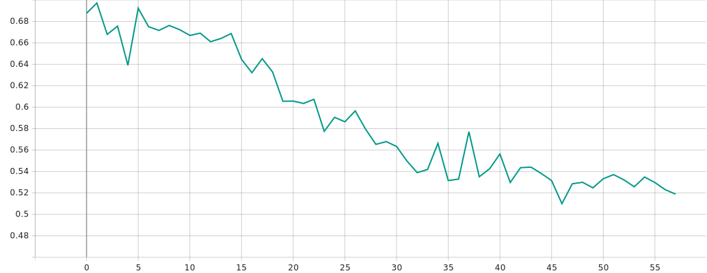
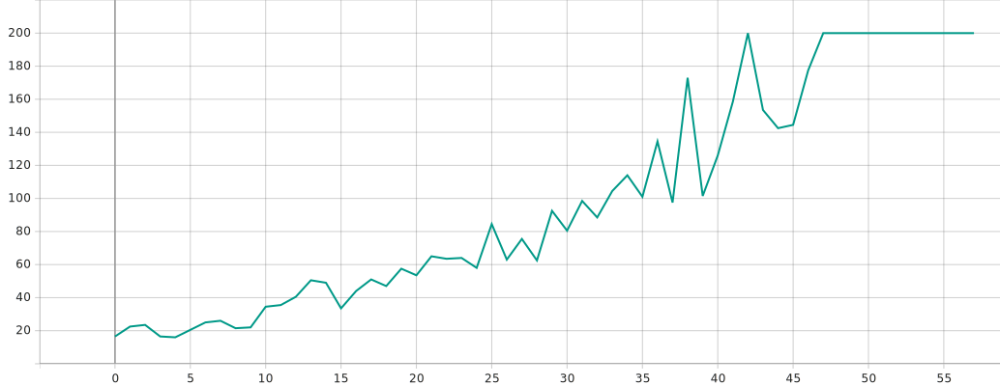

# chap4-The-Cross-Entroy-Method

大部分的知识参照于这篇[cross-entropy method simple intro](https://people.smp.uq.edu.au/DirkKroese/ps/eormsCE.pdf)

`Cross Entropy Method(CE method)`是一种进化策略算法，它虽然也是基于交叉熵，但并不是我们熟知的监督学习中的交叉熵方法。这个算法的核心是一个参数优化的过程。CE method已经成功应用于不同范围的估计和优化问题，包括缓冲区分配、信号检测、DNA排序、交通控制以及神经网络和强化学习等领域。

cross-entropy方法的基础是重要性采样，有以下公式表示：
$$
\mathbb{E}_{x \sim p{x}}[H(x)]=\int_x p(x)H(x)dx=\int_x q(x)\frac{p(x)}{q(x)}H(x)dx=\mathbb{E}_{x \sim q(x)} \bigg[\frac{p(x)}{q(x)}H(x) \bigg]
$$
在强化学习领域，$H(x)$ 是一些策略设定的奖励函数，$x,p(x)$是所有可能的策略的分布。我们不想通过搜索所有可能的策略来最大化奖励，而是希望找到一种方法 $q(x)$ 来近似 $p(x)H(x)$，反复的迭代以最小化两个概率分布之间的距离。两个概率分布之间的距离有Kullback-Leibler(KL)散度计算：
$$
KL(p_1(x)||p_2(x))=\mathbb{E}_{x \sim p_1(x)} \log \frac{p_1(x)}{p_2(x)} =\mathbb{E}_{x \sim p_1(x)}[\log p_1(x)] - \mathbb{E}_{x \sim p_1(x)}[\log p_2(x)]
$$
KL散度中的第一项称为熵，它不依赖于 $p_2(x)$，因此在最小化过程中可以忽略它。第二项叫做交叉熵，这是深度学习中是非常常见的优化目标。结合这两个公式，我们可以得到一个迭代算法，它从 $q_0(x)=p(x)$ 开始，每一步都有所改进。这是 $p(x)H(x)$  的近似值，有一个更新公式：
$$
q_{i+1}(x) = \mathop{\arg\min}_{q_{i+1}(x)}-\mathbb{E}_{x \sim q_i(x)} \frac{p(x)}{q_i(x)} H(x) \log q_{i+1}(x)
$$
这是一种通用的交叉熵方法，可以在我们的RL案例中大大简化。首先，我们将 $H(x)$ 替换为一个指示函数，当奖励高于阈值时为1，当奖励低于阈值时为0。我们的策略更新如下所示：
$$
\pi_{i+1}(\alpha|s) = \mathop{\arg \min}_{\pi_{i+1}} - \mathbb{E}_{\mathrm{z} \sim pi_i(\alpha | \mathrm{s})} [R(\mathrm{z}\geq \psi_i)] \log \pi_{i+1}(\alpha|\mathrm{s})
$$
严格地说，上述公式忽略了规范化项，但在没有规范化项的情况下，它在实践中仍然有效。因此，方法非常明确：我们使用当前策略（从一些随机初始策略开始）对事件进行采样，并最小化最成功的样本负对数可能性。

上述代码的运行结果，在tensorboard查看的效果如下：

loss

reward_bound

reward_mean

